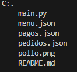

# Trabajo3_Python_GuerreroFranco

Se realizo un software para un restaurante de venta de pollos

## GENERAL

- Descripcion: El software permite navegar entre si mediante menus que muestran opciones especificas, el programa cuenta opciones de:

    - pedido:el menu y diseño nos pide unos datos especificos para basarlo en una fase de datos

- uso: mediante las opciones que se da en los menus

## FUNCIONAMIENTO

- Menus: cuenta con menus interactivos en donde estos le especifican al usuario las opciones disponibles dentro del programa

## LENGUAJES USADOS

- Python

## ESTRUCTURA DEL PROYECTO

## CARACTERISTICAS

- json de menu: cuenta con todos los platos que ofrece el restaurante

- json de pedidos: cuenta con los pedididos que se estan realizando en el restaurante

- json de pagos: cuenta con los pedidos que se han pagado

- el archivo main.py: cuenta con el funcionamiento del software

## DISEÑO

- El diseño del software fue definido por una serie de requisitos propuestos en Notion Instrucciones de uso
- ejecutar el programa desde la terminal de visual code o instalar la extension llamada code runer

## DESARROLLADO POR
- jean franco Guerrero Acero, estudiante de Campuslands como trabajo de Git con ejercicio Python 
